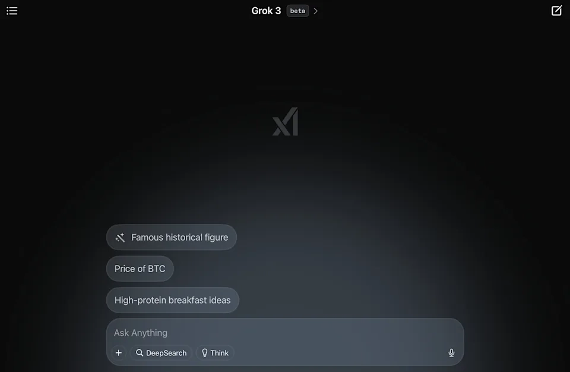
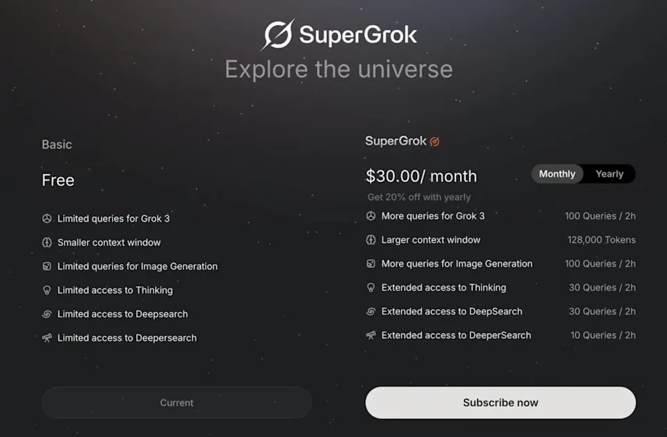

# Grok 3免费开放，SuperGrok订阅详解：功能、价格与使用场景全解析

---

xAI最新发布的Grok 3模型打破了AI行业的常规玩法——推理模式、深度研究等核心功能全部免费开放。如果你正在寻找一个既能满足日常对话需求，又能处理复杂推理任务的AI工具，Grok 3的这波操作值得关注。官方在X平台上半开玩笑地表示，免费使用"直到服务器烧坏为止"，而付费用户则能获得更高的使用额度和优先体验新功能的权限。

---

## Grok 3来了，免费用户也能玩转高级功能

xAI这次的策略挺有意思——不是把功能锁死让你掏钱，而是用使用量来做区分。免费用户可以正常访问Grok 3的所有核心能力，包括推理模式和深度研究功能，只是每两小时的使用次数有限制。

想要上手体验很简单，有三个入口：

1. **网页端**：直接访问grok.com，确认页面下方选择了"Grok 3"模型就能开始对话
2. **iOS应用**：在App Store搜索"Grok"下载独立app
3. **Android应用**：通过Google Play商店安装

对于大多数普通用户来说，免费额度其实够用了。偶尔问问问题、生成点内容、做个简单的推理分析，完全不需要付费。

## SuperGrok订阅值不值？看你的使用场景

如果你是那种一天要跟AI对话几十次、频繁使用深度研究功能的重度用户，SuperGrok的30美元月费（年付300美元，相当于八折）可能就很划算了。

付费后能得到什么？

**使用额度大幅提升：**
- 文字和图片生成：每2小时100次（免费用户次数明显更少）
- 推理模式：每2小时30次查询
- 深度研究：每2小时30次查询
- 深度搜索：每2小时10次

**上下文窗口扩展：**
- 从标准版升级到128,000个token，意味着可以处理更长的对话历史和更复杂的文档分析

**优先体验新功能：**
- 比如即将推出的语音模式，付费用户会更早拿到使用权限

说白了，xAI没有把功能做成付费墙，而是用"用量"来划分用户层级。如果你每天只是零星使用，免费版足够；但如果你把Grok当成工作伙伴，频繁进行复杂任务处理，那付费就是在买效率和便利性。

对于需要长期稳定使用AI工具的专业用户，👉 [除了SuperGrok，也可以考虑其他成熟的AI会员方案来获得更稳定的使用体验](https://shaoyumi.com/buy/66)。毕竟AI工具的选择关键在于找到最适合自己使用场景的那一个。

## 这种定价策略背后的逻辑

xAI的玩法跟OpenAI、Anthropic那套"免费版严格限制功能"的模式不太一样。他们更像是在赌：先用免费吸引大量用户，然后让重度使用者自己意识到"我需要更高的额度"，从而自愿付费。

这种策略对用户来说其实是好事——你不会因为付不起钱就被挡在高级功能门外，只是用得慢一点而已。而对于那些真正需要高频使用的人（比如研究人员、内容创作者、开发者），30美元的月费换来的额度提升确实物有所值。

另外值得注意的是，X Premium+用户也能享受到部分SuperGrok的权益，如果你本来就是X的重度用户，可能会觉得这个组合更划算。

---

Grok 3的免费开放策略让更多人有机会体验最新的AI技术，而SuperGrok订阅则为高频用户提供了明确的价值——更高的使用量、更大的上下文窗口、更早的新功能体验。如果你还在犹豫要不要付费，👉 [不妨先用免费版测试一段时间，看看自己的实际使用频率是否真的需要升级](https://shaoyumi.com/buy/66)。毕竟AI工具的核心价值在于能否真正提升你的工作效率，而不是单纯追求"拥有付费账号"的心理满足。
